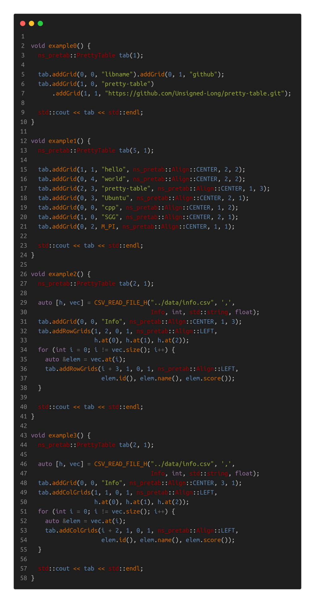

# Pretty Table

[TOC]

___Aurther: csl___

___E-Mainl: 3079625093@qq.com___

```cpp
                                _|      _|                
_|_|_|    _|  _|_|    _|_|    _|_|_|_|_|_|_|_|  _|    _|  
_|    _|  _|_|      _|_|_|_|    _|      _|      _|    _|  
_|    _|  _|        _|          _|      _|      _|    _|  
_|_|_|    _|          _|_|_|      _|_|    _|_|    _|_|_|  
_|                                                    _|  
_|                                                _|_|    
                                            
  _|                _|        _|            
_|_|_|_|    _|_|_|  _|_|_|    _|    _|_|    
  _|      _|    _|  _|    _|  _|  _|_|_|_|  
  _|      _|    _|  _|    _|  _|  _|        
    _|_|    _|_|_|  _|_|_|    _|    _|_|_|  
```


## 1. OverView

this lib is used to tabulate data on the console:

```cpp
// cpp source code
std::cout << ns_pretab::PrettyTable({"lib-name", "version"}).appendRow("Pretty Table", "0.0.1") << std::endl;
// output
+--------------+---------+
|   lib-name   | version |
+--------------+---------+
| Pretty Table |  0.0.1  |
+--------------+---------+
```


## 2. Usage

### 1. Source Code



### 2. Output

```cpp
{'rows': 10, 'colms': 3, 'columns': [{'id': center}, {'name': left}, {'score': right}]}
+--------+--------+-------+
|   id   |  name  | score |
+--------+--------+-------+
| 201901 | Tom    |  81.1 |
+--------+--------+-------+
| 201902 | Jhon   |  93.5 |
+--------+--------+-------+
| 201903 | Jerry  |  95.3 |
+--------+--------+-------+
| 201904 | Albert |  95.6 |
+--------+--------+-------+
| 201905 | Mary   |  81.1 |
+--------+--------+-------+
| 201906 | Lily   |  95.6 |
+--------+--------+-------+
| 201907 | Lina   |  95.3 |
+--------+--------+-------+
| 201908 | Jack   |  81.1 |
+--------+--------+-------+
| 201909 | Bob    |  81.1 |
+--------+--------+-------+
| 201910 | Stack  |  95.3 |
+--------+--------+-------+

{'rows': 9, 'colms': 5, 'columns': [{'id': right}, {'X': right}, {'Y': right}, {'Z': right}, {'distance': right}]}
+----+-------+---------+---------+----------+
| id |   X   |    Y    |    Z    | distance |
+----+-------+---------+---------+----------+
|  8 | 2.749 | 212.558 |  81.043 |  208.451 |
+----+-------+---------+---------+----------+
|  7 | 8.847 |  40.819 | 123.196 |  421.840 |
+----+-------+---------+---------+----------+
|  6 | 9.826 | 164.904 | 123.603 |  236.211 |
+----+-------+---------+---------+----------+
|  5 | 3.282 |  30.125 | 124.372 |  303.018 |
+----+-------+---------+---------+----------+
|  4 | 7.012 | 287.262 |  93.082 |  302.047 |
+----+-------+---------+---------+----------+
|  3 | 9.304 | 301.192 |  31.890 |  128.011 |
+----+-------+---------+---------+----------+
|  2 | 0.077 | 234.593 |  27.598 |  206.319 |
+----+-------+---------+---------+----------+
|  1 | 5.194 | 406.310 | 113.289 |  130.084 |
+----+-------+---------+---------+----------+
|  0 | 2.190 | 204.468 |  40.495 |  227.501 |
+----+-------+---------+---------+----------+

id,X,Y,Z,distance
8,2.749,212.558,81.043,208.451
7,8.847,40.819,123.196,421.840
6,9.826,164.904,123.603,236.211
5,3.282,30.125,124.372,303.018
4,7.012,287.262,93.082,302.047
3,9.304,301.192,31.890,128.011
2,0.077,234.593,27.598,206.319
1,5.194,406.310,113.289,130.084
0,2.190,204.468,40.495,227.501

|id|X|Y|Z|distance|
|----|----|----|----|----|
|8|2.749|212.558|81.043|208.451|
|7|8.847|40.819|123.196|421.840|
|6|9.826|164.904|123.603|236.211|
|5|3.282|30.125|124.372|303.018|
|4|7.012|287.262|93.082|302.047|
|3|9.304|301.192|31.890|128.011|
|2|0.077|234.593|27.598|206.319|
|1|5.194|406.310|113.289|130.084|
|0|2.190|204.468|40.495|227.501|
```

| id   | X     | Y       | Z       | distance |
| ---- | ----- | ------- | ------- | -------- |
| 8    | 2.749 | 212.558 | 81.043  | 208.451  |
| 7    | 8.847 | 40.819  | 123.196 | 421.840  |
| 6    | 9.826 | 164.904 | 123.603 | 236.211  |
| 5    | 3.282 | 30.125  | 124.372 | 303.018  |
| 4    | 7.012 | 287.262 | 93.082  | 302.047  |
| 3    | 9.304 | 301.192 | 31.890  | 128.011  |
| 2    | 0.077 | 234.593 | 27.598  | 206.319  |
| 1    | 5.194 | 406.310 | 113.289 | 130.084  |
| 0    | 2.190 | 204.468 | 40.495  | 227.501  |

## 3. Structure


## 4. Apis

### 1. TabAlign

```cpp
enum class TabAlign {
  /**
   * @brief options
   */
  RIGHT,
  LEFT,
  CENTER
};
```

### 2. Constructors

+ ___TabDataModel(const std::vector<std::string> &headers)___

```cpp
/**
 * @brief Construct a new TabDataModel object
 *
 * @param headers the header labels for the table
 */
```

+ ___TabDataModel()___

```cpp
/**
 * default constructor
 */
```

### 3. Attribute Operator

+ ___const std::string &headerAt(std::size_t column) const___

```cpp
/**
 * @brief get the header label at 'column'
 *
 * @param column
 * @return std::string&
 */
```

+ ___TabDataModel &setHeader(std::size_t column, const std::string header)___

```cpp
/**
 * @brief Set the Header at 'column'
 * 
 * @return TabDataModel& 
 */
```

+ ___const TabAlign &alignAt(std::size_t column) const___

```cpp
/**
 * @brief get the align at 'column'
 *
 * @param column
 * @return TabAlign&
 */
```

+ ___TabDataModel &setAlign(std::size_t column, TabAlign align)___

```cpp
/**
 * @brief Set the Align at 'column'
 * 
 * @return TabDataModel& 
 */
```

+ ___TabDataModel &setAlign(TabAlign align)___

```cpp
/**
 * @brief Set the Align for all columns
 * 
 * @return TabDataModel& 
 */
```

+ ___const std::size_t &precisionAt(std::size_t column) const___

```cpp
/**
 * @brief get the precision at 'column'
 *
 * @return std::size_t&
 */
```

+ ___TabDataModel &setPrecision(std::size_t column, std::size_t precision)___

```cpp
/**
 * @brief Set the Precision at 'column'
 * 
 * @return TabDataModel& 
 */
```

+ ___TabDataModel &setPrecision(std::size_t precision)___

```cpp
/**
 * @brief Set the Precision for all columns
 * 
 * @return TabDataModel& 
 */
```

### 4. Data Operator

+ ___template <typename ItemType> TabDataModel &setItem(const ItemType &item, std::size_t row, std::size_t column)___

```cpp
/**
 * @brief Set the Item at [row, column]
 *
 * @return TabDataModel&
 */
```

+ ___template <typename... ArgvsType> TabDataModel &appendRow(const ArgvsType &...argvs)___

```cpp
/**
 * @brief add a row to the end of the table
 *
 * @tparam ArgvsType the types of the argvs
 * @param argvs the arguements
 * @return TabDataModel&
 */
```

+ ___TabDataModel &appendColumn(const std::string &header, TabAlign align = TabAlign::CENTER, std::size_t precision = 1)___

```cpp
/**
 * @brief add a column to the end of the table
 *
 * @return TabDataModel&
 */
```

+ ___inline PrettyTable &insert_colums(const std::vector< std::string> &headers, int colm_index)___

```cpp
  /**
   * @brief add a column at the 'colm_index' of this table
   *
   * @param headers the header labels
   * @param colm_index the index of the column to start inserting
   * @return PrettyTable&
   */
```

### 5. Helpers

+ ___std::string toCSV(char splitor = ',') const___

```cpp
/**
 * @brief translate the table to csv file format
 *
 * @param splitor the splitor
 * @return std::string
 */
```

+ ___static PrettyTable fromCSV(const std::string &filename, std::size_t columnCount, std::size_t precision = 1, bool withHeaders = true, char splitor = ',')___

```cpp
/**
 * @brief load the csv file data to comstruct a table
 *
 * @param filename the name of csv file
 * @param columnCount the count of columns
 * @param withHeaders is the csv file with headers
 * @param splitor the splitor
 * @return PrettyTable
 */
```

+ ___std::string toMarkDown() const___

```cpp
/**
 * @brief translate the table to mark down format
 *
 * @return std::string
 */
```

+ ___std::string tableInfo() const___

```cpp
/**
 * @brief print the table's info
 * 
 * @return std::string 
 */
```


