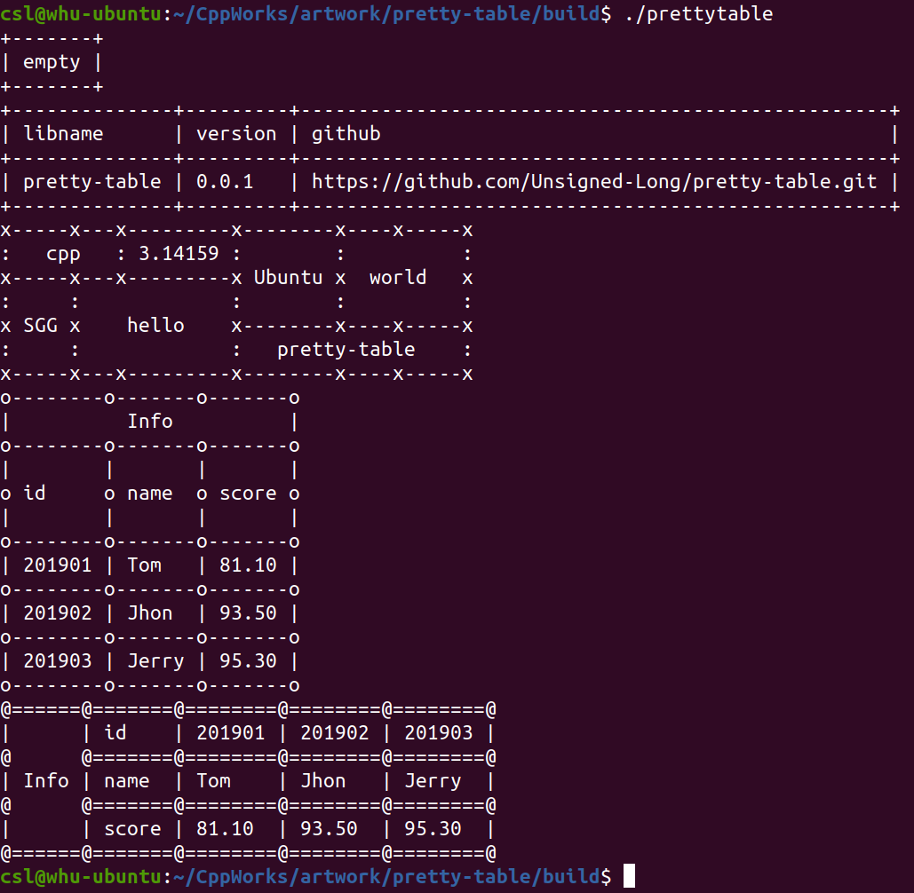

# Pretty Table

[TOC]

___Aurther: csl___

___E-Mainl: 3079625093@qq.com___

```cpp
                                _|      _|                
_|_|_|    _|  _|_|    _|_|    _|_|_|_|_|_|_|_|  _|    _|  
_|    _|  _|_|      _|_|_|_|    _|      _|      _|    _|  
_|    _|  _|        _|          _|      _|      _|    _|  
_|_|_|    _|          _|_|_|      _|_|    _|_|    _|_|_|  
_|                                                    _|  
_|                                                _|_|    
                                            
  _|                _|        _|            
_|_|_|_|    _|_|_|  _|_|_|    _|    _|_|    
  _|      _|    _|  _|    _|  _|  _|_|_|_|  
  _|      _|    _|  _|    _|  _|  _|        
    _|_|    _|_|_|  _|_|_|    _|    _|_|_|  
```


## 1. OverView

this lib is used to tabulate data on the console:

```cpp
// cpp source code
tab.addGrid(0, 0, "libname").addGrid(0, 1, "github");
tab.addGrid(1, 0, "pretty-table").addGrid(1, 1, "https://github.com/Unsigned-Long/pretty-table.git");
// output
+--------------+---------------------------------------------------+
| libname      | github                                            |
+--------------+---------------------------------------------------+
| pretty-table | https://github.com/Unsigned-Long/pretty-table.git |
+--------------+---------------------------------------------------+
```

code:

```cpp
tab.addGrid(1, 1, "hello", ns_pretab::Align::CENTER, 2, 2);
tab.addGrid(0, 4, "world", ns_pretab::Align::CENTER, 2, 2);
tab.addGrid(2, 3, "pretty-table", ns_pretab::Align::CENTER, 1, 3);
tab.addGrid(0, 3, "Ubuntu", ns_pretab::Align::CENTER, 2, 1);
tab.addGrid(0, 0, "cpp", ns_pretab::Align::CENTER, 1, 2);
tab.addGrid(1, 0, "SGG", ns_pretab::Align::CENTER, 2, 1);
tab.addGrid(0, 2, "^-^", ns_pretab::Align::CENTER, 1, 1);
```

output:

```cpp
+-----+---+-----+--------+----+-----+
|   cpp   | ^-^ |        |          |
+-----+---+-----+ Ubuntu +  world   +
|     |         |        |          |
+ SGG +  hello  +--------+----+-----+
|     |         |   pretty-table    |
+-----+---+-----+--------+----+-----+
```

code:

```cpp
tab.addGrid(0, 0, h.at(0)).addGrid(0, 1, h.at(1)).addGrid(0, 2, h.at(2));
for (int i = 0; i != vec.size(); i++) {
  auto &elem = vec.at(i);
  tab.addGrid(i + 1, 0, elem.id()).addGrid(i + 1, 1, elem.name()).addGrid(i + 1, 2, elem.score());
}
```

output:

```cpp
+--------+--------+-------+
| id     | name   | score |
+--------+--------+-------+
| 201901 | Tom    | 81.1  |
+--------+--------+-------+
| 201902 | Jhon   | 93.5  |
+--------+--------+-------+
| 201903 | Jerry  | 95.3  |
+--------+--------+-------+
| 201904 | Albert | 95.6  |
+--------+--------+-------+
| 201905 | Mary   | 81.1  |
+--------+--------+-------+
| 201906 | Lily   | 95.6  |
+--------+--------+-------+
| 201907 | Lina   | 95.3  |
+--------+--------+-------+
| 201908 | Jack   | 81.1  |
+--------+--------+-------+
| 201909 | Bob    | 81.1  |
+--------+--------+-------+
| 201910 | Stack  | 95.3  |
+--------+--------+-------+
```


## 2. Usage

### 2.1 Source Code


### 2.2 Output



## 3. Structure


## 4. Apis

### 4.1 Align

```cpp
enum class Align {
  /**
   * @brief options
   */
  RIGHT,
  LEFT,
  CENTER
};
```


### 4.2 PrettyTable

```cpp
template <typename Type> PrettyTable &addGrid(std::size_t row, std::size_t col, const Type &content, Align align = Align::LEFT, std::size_t rowspan = 1, std::size_t colspan = 1);
```


